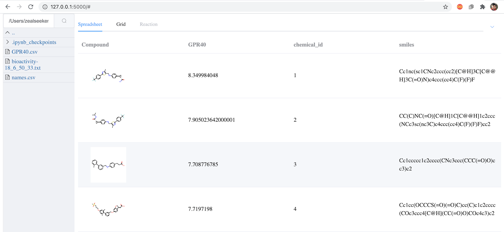
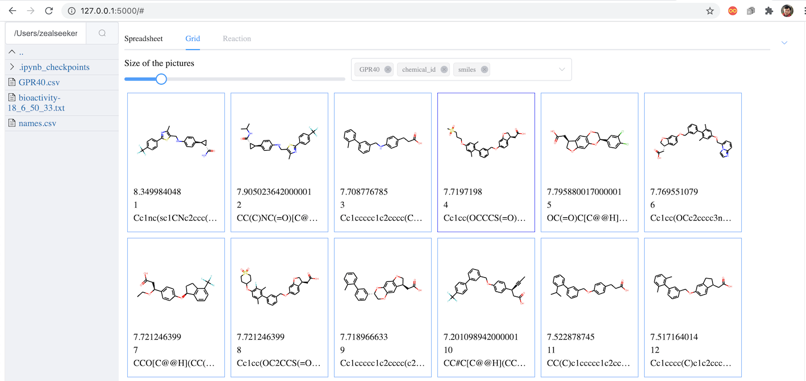

# Chemviewer
Chemviewer is a web based application to view 2D chemical structures or reactions in a table.
The local version supports both text input and file selection (from local directory).




## How to use locally

### Start the application
Type in `chemviewer` in the work directory or type `chemviewer table.txt`
to browse the `table.txt`. The input file should have title line and 
there should be one column of which the title is "smi", "smiles", or
"cannonical_smiles" (case insensitive).

### How to install

```
pip install chemviewer
```

If you do not have a Python environment including RDKit and Flask,
you can download [anaconda](https://www.anaconda.com/)
and install them as the following:
```
wget https://repo.anaconda.com/miniconda/Miniconda3-latest-Linux-x86_64.sh
bash Miniconda3-latest-Linux-x86_64.sh
```
Then install the dependencies:
```
conda create -n chemviewer -c conda-forge rdkit
conda activate chemviewer
conda install flask
```

## Dependency
- RDKit
- Flask
